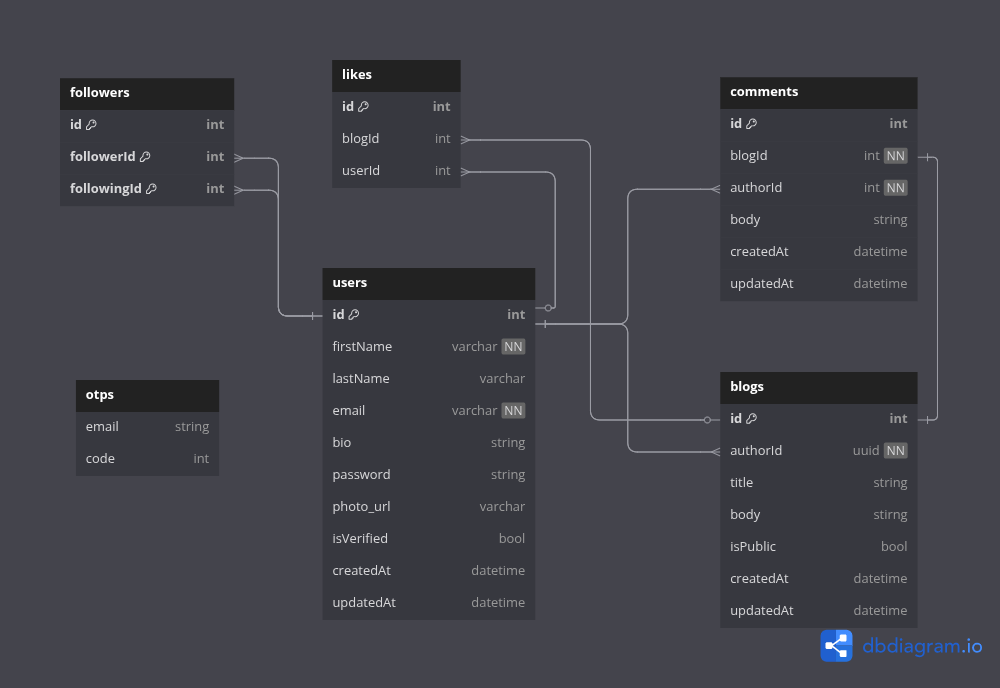

# Blog APIs

A robust and scalable RESTful API for a blogging platform built with NestJS, TypeScript, and MySQL. This project demonstrates modern backend development practices with clean architecture, comprehensive authentication, and flexible service integrations.

## Table of Contents

- [Blog APIs](#blog-apis)
  - [Table of Contents](#table-of-contents)
  - [Features](#features)
  - [Tech Stack](#tech-stack)
  - [Database Schema (ERD)](#database-schema-erd)
  - [Architecture Highlights](#architecture-highlights)
    - [Generic Email Module](#generic-email-module)
    - [Configurable Upload Module](#configurable-upload-module)
  - [Getting Started](#getting-started)
    - [Option 1: Docker Setup (Recommended) 🐳](#option-1-docker-setup-recommended-)
      - [Prerequisites](#prerequisites)
      - [Quick Start](#quick-start)
    - [Option 2: Local Development Setup 💻](#option-2-local-development-setup-)
      - [Prerequisites](#prerequisites-1)
      - [Installation Steps](#installation-steps)
    - [Environment Configuration](#environment-configuration)
  - [API Documentation](#api-documentation)
  - [Quick API Overview](#quick-api-overview)
    - [Authentication Endpoints](#authentication-endpoints)
    - [Blog Endpoints](#blog-endpoints)
    - [User \& Social Features](#user--social-features)
  - [Project Structure](#project-structure)
  - [Database Seeding](#database-seeding)
  - [Contributing](#contributing)
    - [Development Guidelines](#development-guidelines)
  - [Environment-Specific Features](#environment-specific-features)
  - [Deployment](#deployment)
  - [License](#license)
  - [Support](#support)

---

## Features

- **User Authentication & Authorization** - JWT-based auth with email verification
- **Blog Management** - Create, read, update, and delete blog posts (public/private)
- **Comment System** - Users can comment on public blogs
- **Social Features** - Follow/unfollow users and like blog posts
- **File Upload** - Profile picture uploads with multiple storage providers
- **Email Integration** - Verification emails and password reset functionality
- **Database Seeding** - Pre-populated data for development and testing
- **API Documentation** - Interactive Swagger/OpenAPI documentation
- **Dockerized** - Ready for containerized deployment
- **Flexible Architecture** - Generic email and upload modules using factory pattern

[🔝 Back to Top](#table-of-contents)

---

## Tech Stack

- **Framework**: NestJS (Node.js)
- **Language**: TypeScript
- **Database**: MySQL with TypeORM
- **Authentication**: JWT
- **File Upload**: Cloudinary (configurable)
- **Email**: Multiple providers (Brevo, SendGrid, Mailtrap)
- **Documentation**: Swagger/OpenAPI
- **Validation**: class-validator & class-transformer
- **Containerization**: Docker & Docker Compose

[🔝 Back to Top](#table-of-contents)

---

## Database Schema (ERD)



## Architecture Highlights

This project showcases some interesting architectural patterns:

### Generic Email Module

I've implemented a flexible email system using the **Factory Pattern** that allows switching between different email providers (Brevo, SendGrid, Mailtrap) based on the environment:

- **Development**: Mailtrap (for testing)
- **Staging**: SendGrid
- **Production**: Brevo
  The beauty of this approach is that you can easily add new email providers without changing existing code - just implement the [`EmailProvider`](src/email/interfaces/email-provider.interface.ts) interface!

### Configurable Upload Module

Similarly, the upload module is built to be provider-agnostic. Currently configured for Cloudinary, but designed to easily support other storage solutions like AWS S3, Firebase, or local storage through the same factory pattern approach.
[🔝 Back to Top](#table-of-contents)

---

## Getting Started

You have two options to run this project: **Docker** (recommended) or **Local Development**.

### Option 1: Docker Setup (Recommended) 🐳

This is the easiest way to get up and running quickly!

#### Prerequisites

- Docker
- Docker Compose

#### Quick Start

1. **Clone the repository**

```bash
git clone https://github.com/MohamedAboElnaser/Blog-apis.git
cd Blog-apis
```

2. **Environment Setup**

```bash
# Copy the example environment file
cp .env.example .env

# Edit the .env file with your configurations
nano .env  # or use your preferred editor
```

3. **Run with Docker Compose**

```bash
# For development (with hot reload)
docker compose up --build

# For production
docker compose -f docker-compose.prod.yml up --build -d
```

4. **Seed the database (optional)**

```bash
# Access the running container
docker compose exec app npm run seed

# Or force seed (clears existing data)
docker compose exec app npm run seed:force
```

That's it! Your API will be available at `http://localhost:3000` 🎉

### Option 2: Local Development Setup 💻

#### Prerequisites

- Node.js (>=18)
- MySQL database
- npm or yarn

#### Installation Steps

1. **Clone the repository**

```bash
git clone https://github.com/MohamedAboElnaser/Blog-apis.git
cd Blog-apis
```

2. **Install dependencies**

```bash
npm install
```

3. **Environment Setup**

```bash
# Copy the example environment file
cp .env.example .env

# Edit the .env file with your configurations
nano .env  # or use your preferred editor
```

4. **Database Setup**
   Make sure your MySQL database is running and create the database specified in your .env file.

5. **Run the application**

```bash
# Development mode
npm run start:dev

# Production mode
npm run build
npm run start:prod
```

6. **Seed the database (optional)**

```bash
# Regular seeding (skips if data exists)
npm run seed

# Force seeding (clears existing data)
npm run seed:force
```

[🔝 Back to Top](#table-of-contents)

---

### Environment Configuration

Create a .env file based on [.env.example](./.env.example) and fill in your specific configurations. This file contains sensitive information like database credentials, JWT secrets, and email provider settings.
[🔝 Back to Top](#table-of-contents)

---

## API Documentation

Once the application is running, visit `http://localhost:3000/api` to access the interactive Swagger documentation. Here you'll find detailed information about all endpoints, request/response schemas, and can even test the API directly from the browser!
[🔝 Back to Top](#table-of-contents)

---

## Quick API Overview

### Authentication Endpoints

- `POST /auth/register` - Register a new user
- `POST /auth/verify-email` - Verify email with OTP
- `POST /auth/login` - User login
- `POST /auth/request-password-reset` - Request password reset
- `POST /auth/reset-password` - Reset password with OTP

### Blog Endpoints

- `GET /blogs` - Get user's blogs (authenticated)
- `POST /blogs` - Create a new blog
- `GET /blogs/public` - Get all public blogs
- `GET /blogs/:id` - Get specific blog details
- `PUT /blogs/:id` - Update blog
- `DELETE /blogs/:id` - Delete blog

### User & Social Features

- `GET /users/me` - Get current user profile
- `GET /users/:id/blogs` - Get user's public blogs
- `POST /users/:id/follow` - Follow a user
- `DELETE /users/:id/unfollow` - Unfollow a user
- `POST /blogs/:id/like` - Like a blog
- `DELETE /blogs/:id/unlike` - Unlike a blog

[🔝 Back to Top](#table-of-contents)

---

## Project Structure

```
src/
├── auth/              # Authentication module (JWT, guards, strategies)
├── blog/              # Blog management (CRUD operations)
├── comment/           # Comment system for blogs
├── common/            # Shared utilities and DTOs
├── database/          # Database configuration and seeders
├── email/             # Generic email module with multiple providers
├── follow/            # User following system
├── like/              # Blog liking functionality
├── otp/               # OTP generation and verification
├── upload/            # Generic file upload module
├── user/              # User management and profiles
├── app.module.ts      # Main application module
└── main.ts           # Application entry point

scripts/
└── seed.ts           # Database seeding script

docker-compose.yml          # Development Docker setup
docker-compose.prod.yml     # Production Docker setup
Dockerfile                  # Multi-stage Docker build
.env.example               # Environment variables template
```

[🔝 Back to Top](#table-of-contents)

---

## Database Seeding

The project includes a comprehensive seeding system that creates:

- **Test users** with verified accounts
- **Sample blog posts** (public and private)
- **Comments** on public blogs
- **Follow relationships** between users
- **Likes** on blog posts

This makes it super easy to get started with development - just run the seed command and you'll have a fully populated database to work with!

[🔝 Back to Top](#table-of-contents)

---

## Contributing

I'd love your contributions! Here's how you can help:

1. **Fork the repository**
2. **Create a feature branch** (`git checkout -b feature/amazing-feature`)
3. **Make your changes** and add tests if applicable
4. **Commit your changes** (`git commit -m 'Add some amazing feature'`)
5. **Push to the branch** (`git push origin feature/amazing-feature`)
6. **Open a Pull Request**
[🔝 Back to Top](#table-of-contents)

---
### Development Guidelines

- Follow the existing code style and patterns
- Update documentation if needed
- Use descriptive commit messages
- Test both Docker and local setups
[🔝 Back to Top](#table-of-contents)

---
## Environment-Specific Features

The application automatically adapts based on the `NODE_ENV`:

- **Development**: Uses Mailtrap for emails, detailed logging
- **Staging**: Uses SendGrid for emails
- **Production**: Uses Brevo for emails, optimized logging

## Deployment

The project is production-ready with:

- Multi-stage Docker builds for optimized images
- Production Docker Compose configuration
- Environment-based configurations
- Health checks and restart policies

## License

This project is licensed under the MIT License - see the [LICENSE](./LICENCE) file for details.

## Support

If you have any questions or run into issues, feel free to:

- Open an issue on GitHub
- Check the Swagger documentation at `/api`
- Review the seeded data examples
[🔝 Back to Top](#table-of-contents)

---